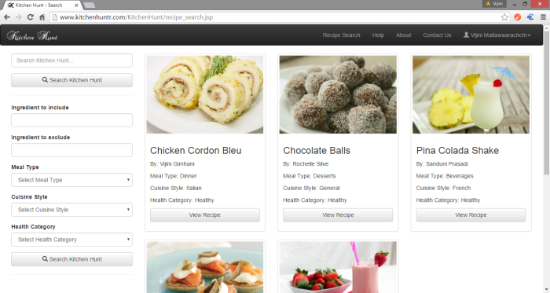

  

# Kitchen Hunt: Recipe Search with Ingredients in your Kitchen

At present, cooking has become very popular all over the world. There are many foods made worldwide which are associated to different cultures, traditions and countries. Day by day, many new recipes and dishes emerge as people tend to try out new recipes and make new foods by combining ingredients and aspects of different cuisine styles.

## Why Kitchen Hunt?

Many people tend to try out cooking with the ingredients which they already have in their pantries. However, a majority faces problems when it comes to searching recipes which contains particular ingredients, recipes of certain meal types and cuisine styles. It is difficult to precisely search the recipes which contains only the particular ingredients available. It takes a lot of time and effort to find the exact recipe that contains the ingredients available.

At present, there are many websites from which users can get recipe details. However, most of them have simple searching capabilities. Kitchen Hunt was developed in order to address these problems discussed and provide best searching capabilities to search recipes.

  

## What is Kitchen Hunt?

Kitchen Hunt is a web based application which provides the best searching capabilities to search recipes online. Once the ingredients available are entered, users can easily find the recipes which can be made using those ingredients. This saves the time spent on referring lengthy recipe books and cook books. Users can easily customize the search so as to suit their preferences of certain types of foods and they can also explore recipes of different cuisines, cultures and countries.

## Features of Kitchen Hunt

Kitchen Hunt consists of an enhanced recipe search facility from which users can search recipes which contain certain ingredients, excluding certain ingredients as well as belonging to different meal types, cuisine styles and health categories. From the results returned, you can select the recipe you want and view the details.

  

  

  

Users can also create their own My Kitchen account and post new recipes, save recipes to refer, request for recipes, rate recipes and comment on recipes.

The admin panel of Kitchen Hunt provides the administrator with various admin tasks to perform such as reviewing recipes, publishing recipes and view statistics regarding application activities.

  

  

Kitchen Hunt also acts as a platform to connect people who are interested in different cuisine styles and allow them to share their knowledge with others as well. Users from different cultures can share their own cooking knowledge with others and can learn about cooking styles of other cultures as well.

## Future Work

Kitchen Hunt will collaborate with local supermarkets so that the supermarkets can advertise their products along with the ingredients for each recipe. The supermarkets where the ingredients are available will be displayed and based on the user’s location, the nearest supermarkets where the users can buy these ingredients will be displayed. The price of ingredients in each supermarket will be available for the user and the total cost for each recipe will be calculated and displayed so that the user can compare the options available and chose.

Note: This is a web application which can search recipes online. It is developed for the Software Engineering Project module of Semester 5 of Department of Computer Science and Engineering, University of Moratuwa.
